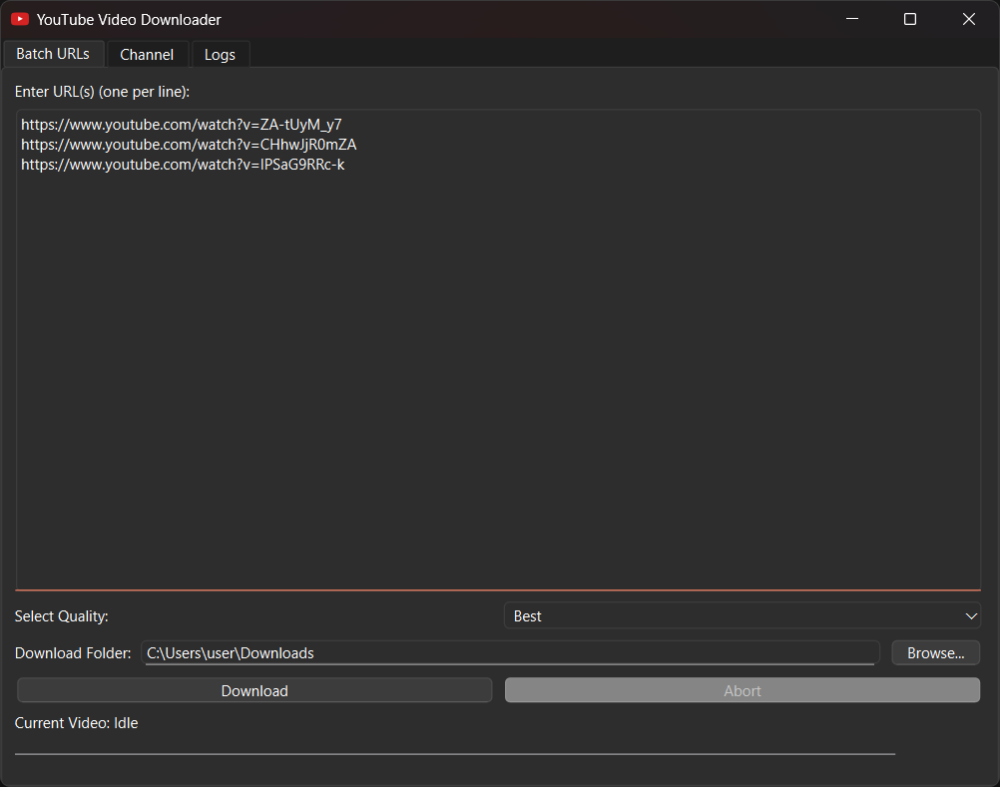
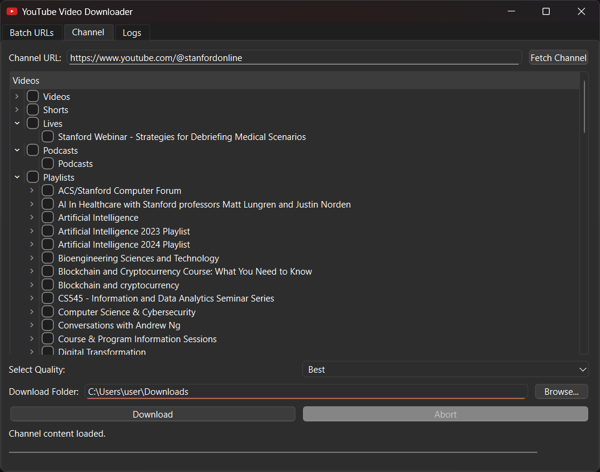

# YouTube Downloader

YouTube Downloader is a user-friendly application that allows you to download videos from YouTube effortlessly. With features like batch and channel downloads, managing your favorite content has never been easier.

## Features

- **Batch URLs Download:** Download multiple videos simultaneously by providing a list of URLs.
- **Channel Download:** Download all or select videos from a specific YouTube channel with a single click.
- **Quality Selection:** Choose the desired quality for your downloads, including options up to 4K Ultra HD.
- **User-Friendly Interface:** Navigate through the application's features with ease, thanks to its intuitive design.

## Screenshots

#### *Batch URLs Tab*

#### *Channel Tab*

## Download

Download the latest version of YouTube Downloader from [here](https://github.com/rohan-gt/youtube-downloader/releases/download/v0.1.0/YoutubeDownloader.exe).

---

*Note: This application is intended for personal use only. Please ensure you have the necessary permissions to download any content and comply with YouTube's terms of service.*
